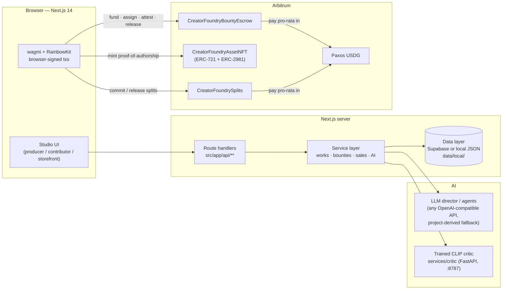

# Creator Foundry

**AI-planned creative production where the reward is locked on-chain before the work starts.**

[](#why-arbitrum)
[](#smart-contracts)
[](#smart-contracts)
[](#ai--critic-system)

> Built for the **Arbitrum Open House Singapore — Online Buildathon**, September 2026.

---

## Problem

Creative work is commissioned in good faith and paid on bad faith. A producer posts a brief,
contributors spend days on it, and the money is "coming" — with nothing backing that promise.
Without escrow, a bounty reward is only a producer's *intention*: if they never sign, the artist is
unpaid with no recourse. Existing platforms compound it:

- **Payment trust** — rewards are promises, not locked funds; late or missing payouts are normal.
- **Attribution** — contributors have no portable proof they made the thing.
- **Splits** — when a work sells later, nobody can prove who was owed what, so revenue is split by
  memory and goodwill.
- **AI opacity** — "AI-reviewed" usually means an LLM made up a number nobody can reproduce.

## Solution

Creator Foundry is a production studio where every promise is a contract:

1. An **AI production director** turns a brief into scoped bounties with roles, rewards and
   deliverable specs, and keeps a persistent creative memory (palette, characters, tone).
2. The producer **locks the reward in escrow before any work starts** — USDG plus a hash of the
   brief — with two independent on-chain clocks so neither side can profit by going silent.
3. Contributors deliver, and sign a hash of what they handed over.
4. A **trained AI critic** scores the delivery (style consistency, palette match, technical
   quality, 0–100) against *that project's* art direction.
5. One approval **mints an ERC-721 proof-of-authorship** *and* releases the money; both artifact
   hashes and the critic score are written into the token metadata.
6. If the producer never reviews it, the review window expires and **anyone** can call
   `autoRelease()` — the contributor pays themselves.
7. When the finished work sells, an **immutable on-chain split table** pays every contributor
   pro-rata in USDG — permissionlessly, on every sale.

## Why Arbitrum

| | |
|---|---|
| **Home chain** | **Arbitrum Sepolia (421614)** — the buildathon's chain; all three contracts deployed and readable on Arbiscan. |
| **Orbit chain** | **Robinhood Chain Testnet (46630)** — an Arbitrum Orbit chain where the full demo loop executed with **real Paxos USDG** (tx links below). |
| **Stablecoin** | Settlement in **Paxos USDG**, the featured stablecoin — bounties, escrow and copy sales are denominated in dollars, not volatile tokens. |
| **Why L2 at all** | Escrow funding, SLA clock ticks, NFT mints and per-sale splits are *many small value transfers*. Arbitrum's low fees and fast finality make locking a 1.8 USDG bounty economically sensible — the same design on L1 would be eaten by gas. |
| **What is onchain vs offchain** | **Onchain:** escrow funding/release, both SLA clocks, delivery attestations, critic score stamp, NFT mint + ERC-2981 royalties, immutable split tables, USDG payouts. **Offchain:** briefs, assets, AI planning/critique, UI state (local JSON store or Supabase). |

Contracts are resolved **per chain** from [`contracts/deployments.json`](contracts/deployments.json);
setting `NEXT_PUBLIC_CHAIN` switches the whole contract set atomically — no redeploys, no
hardcoded addresses in the UI.

---

## Architecture



---

## Core features

- **AI production director** — brief → scoped bounties (role, reward, deliverable spec) with
  persistent creative memory.
- **Escrow with two clocks** — `deliveryWindow` (producer refunds if nothing arrived) and
  `reviewWindow` (anyone can `autoRelease()` on expiry) — neither party can grief the other by
  going silent.
- **Proof-of-authorship NFTs** — every approved delivery mints an ERC-721 with the asset hash,
  contributor address and critic score in metadata; ERC-2981 royalties set at mint.
- **Trained (not prompted) AI critic** — frozen CLIP ViT-B/32 + trained MLP head, deterministic
  0–100 scoring against the project's own palette plate.
- **Immutable USDG splits** — sealing a work commits the participant table on-chain; every copy
  sale pays contributors pro-rata, permissionlessly.
- **Storefront** — buyers purchase copies with wallet-signed USDG; revenue routes straight into
  the split contract.
- **AI publishing hub** — generated Steam copy, social thread and portfolio brief per release.
- **Zero-config evaluation** — no Supabase → local JSON store; no LLM key → project-derived
  reasoning; no critic service → transparent fallback.

## Tech stack

| Layer | Choice |
|---|---|
| **Frontend** | Next.js 14 (App Router), TypeScript, Tailwind CSS design system (`src/styles/design-system`) |
| **Backend** | Next.js route handlers + service layer (`src/lib/services/*`); `{ ok, data } \| { ok: false, error }` contract |
| **Wallet** | wagmi 2 + viem + RainbowKit; every state-changing action is browser-signed |
| **AI** | Any OpenAI-compatible LLM (Groq/OpenRouter/OpenAI…) + deterministic project-derived fallback |
| **Critic** | Python, FastAPI, PyTorch, open_clip (CLIP ViT-B/32) — `services/critic/` |
| **Smart contracts** | Solidity 0.8.26 — `CreatorFoundryAssetNFT`, `CreatorFoundrySplits`, `CreatorFoundryBountyEscrow` |
| **Blockchain** | Arbitrum Sepolia (421614) + Robinhood Chain Testnet (46630, Orbit) |
| **Settlement** | Paxos USDG (real stablecoin, no mocks) |
| **Storage** | Supabase (Postgres + storage) *or* zero-config local JSON store + `data/uploads/` |

## How it works

| Step | Who | What actually happens |
|---|---|---|
| 1 | Producer | AI breaks the brief into bounties — role, reward, deliverable spec — and keeps a persistent creative memory. |
| 2 | Producer | `fund()` locks USDG **plus a hash of the brief** in `CreatorFoundryBountyEscrow`, before any work begins. |
| 3 | Contributor | Sees *"1.8 USDG locked"* on the task before accepting it. Claims it, delivers, signs `attestDelivery(briefKey, deliveryHash)`. |
| 4 | Machine | The trained critic scores style consistency, palette match and technical quality 0–100. |
| 5 | Producer | Approves. One flow mints the authorship NFT and calls `release(key, criticScore)` — hashes + score written into token metadata. |
| 6 | Nobody | If step 5 never happens, `reviewDeadline` expires and **any address** can call `autoRelease()` — the contributor pays themselves. |
| 7 | Buyer | Buys a copy in USDG → `splits.release()` pays the whole team pro-rata, permissionlessly. |

### Why it isn't just "escrow with a timer"

Single-timer escrow is griefable: one side waits the clock out. Creator Foundry runs **two
independent windows**, both chosen by the producer at assignment time (bounded in-contract by
`MIN_WINDOW = 5 minutes` … `MAX_WINDOW = 90 days`). `refund()` is blocked the moment delivery is
attested; `release()` never requires the attestation (it only ever moves money *toward* the
contributor, so requiring it could strand a legitimate payout).

## Smart contracts

Three contracts written for this project — see [`contracts/README.md`](contracts/README.md) for
full detail. Deployment registry: [`contracts/deployments.json`](contracts/deployments.json).

| Contract | Purpose | Deployed size |
|---|---|---|
| `CreatorFoundryAssetNFT` | ERC-721 + ERC-2981 proof-of-authorship; royalty receiver set per mint | 5,910 B |
| `CreatorFoundrySplits` | USDG revenue distributor — immutable payout table, permissionless `release()` | 4,414 B |
| `CreatorFoundryBountyEscrow` | Two-clock bounty escrow with permissionless SLA release | 5,252 B |

### Addresses

**Robinhood Chain Testnet — 46630** (Arbitrum Orbit, primary demo chain):

| Contract | Address |
|---|---|
| AssetNFT | `0xb176b9ea780c534c47c15a9651f7af1b80302b10` |
| Splits | `0x66ffff1d5bd5cd41e4cd9695875f1e8e96bdd845` |
| BountyEscrow | `0x6390674fe1ac130c145299396a5441510d052062` |
| Paxos USDG (real) | `0x7E955252E15c84f5768B83c41a71F9eba181802F` |

**Arbitrum Sepolia — 421614** (buildathon home chain; all three live):

| Contract | Address |
|---|---|
| AssetNFT | `0xd63401c8b86c5baa85e4af0e141c4bb55cf4f5ca` |
| Splits | `0x381f563514b264e7142bd3ea090e34350c0e6693` |
| [BountyEscrow](https://sepolia.arbiscan.io/address/0x0a002725a40c46fcdbc7cca488f6469b8203ce96) | `0x0a002725a40c46fcdbc7cca488f6469b8203ce96` |
| Paxos USDG | `0xFFC95faa3d63Cde504a05B567C600B78C0b41892` |

### Proven on-chain (Robinhood Testnet)

A complete loop — locked → assigned → minted → scored → paid → split → sold — with real USDG:

| Step | Transaction |
|---|---|
| Reward locked (+ brief hash) | [`0x8c4aaff3…`](https://explorer.testnet.chain.robinhood.com/tx/0x8c4aaff3b0e3c1a6a1095845bfb910cc740b074795349e4fedb660ba0813ff3f) |
| Contributor assigned, SLA clocks started | [`0x8f7cc410…`](https://explorer.testnet.chain.robinhood.com/tx/0x8f7cc410037819926610a1e4a5ee9fdd4979d8fb9017e5c348c5adbab7234fca) |
| Authorship NFT minted to contributor | [`0x5b1875a6…`](https://explorer.testnet.chain.robinhood.com/tx/0x5b1875a627ec98d7e2dff03404e2f115772fc348f0eadfa26636cd7f1a1b7437) |
| Escrow released, `criticScore = 80` stamped | [`0x4f6c9be2…`](https://explorer.testnet.chain.robinhood.com/tx/0x4f6c9be2c727534017d6f4d07050da5d83472f4508a8f02f74cae395e0694afd) |
| Work release NFT minted | [`0xb1f07f3f…`](https://explorer.testnet.chain.robinhood.com/tx/0xb1f07f3f465ff51fddb306042f09d4405862b766959b42b93084fbd7ee88f55f) |
| Immutable USDG split table committed | [`0x523fc989…`](https://explorer.testnet.chain.robinhood.com/tx/0x523fc9896a9f0090a1924a45358b8cf0f47df5b10c67d4fce168fc4d76a9fa1c) |
| Copy bought (3 USDG into the split) | [`0xf90b5249…`](https://explorer.testnet.chain.robinhood.com/tx/0xf90b5249b7454c1c16b7f8797f369e709da235d448ac6ae281349a95d72b0d3d) |
| `release()` pays every contributor pro-rata | [`0x3e8fa360…`](https://explorer.testnet.chain.robinhood.com/tx/0x3e8fa360bad991c6d18fd940ea520b30dca121ef6972a543a6eba17e4ffd1c8a) |

Read-back confirmed: `released = true`, `criticScore = 80`, contributor USDG balance `0 → 1.8`,
`ownerOf(1)` = contributor, split table `committed = true` with 3 USDG released.

## AI / Critic system

**The critic is a genuinely trained model, not a prompt** (`services/critic/`):

```
asset ──► CLIP ViT-B/32 (frozen) ──► 512-d embedding ─┐
reference ──► CLIP ──► 512-d embedding ───────────────┤
                                                      ▼
                                        trained MLP head (ours)
                                        ├─ style_score   0–100
                                        ├─ palette_match 0–1
                                        └─ quality       0–100
```

- Served over FastAPI (`npm run critic`, port 8787); the app calls it only when
  `CRITIC_SERVICE_URL` is set and falls back transparently otherwise.
- Scores a delivery against **that project's palette plate** derived from its creative memory —
  the verdict is deterministic (same inputs → same scores) and the score is stamped on-chain at
  release, making it *evidence*, not an opinion.
- Trains in ~1–2 minutes on a MacBook from a fully synthetic dataset (controlled distortions
  with known labels) — no dataset licensing issues.
- The **LLM layer** (director, story, publishing, chat) is separate: any OpenAI-compatible
  endpoint, with a project-derived local fallback when no key is set.

## Demo

```bash
npm install
cp .env.example .env.local     # everything inside is optional
npm run dev                    # auto-picks a free port (prefers 3000)
```

Open the printed URL. The seeded demo work ("Neon Requiem") walks the full journey:
**brief → AI-planned bounties → escrow → delivery → critic score → mint → seal → storefront →
USDG split**.

Anyone can re-verify the on-chain claims without a wallet or a key:

```bash
npm run verify     # read-only, 37 checks against the live registries
```

## Local development

```bash
npm install
npm run dev              # Next.js dev server (per-port build dirs, several can run at once)
npm run typecheck        # tsc --noEmit
npm run build            # production build (must pass before submitting)

# optional: trained AI critic
npm run critic:setup     # creates services/critic/.venv + installs requirements
npm run critic           # FastAPI on :8787

# demo / ops scripts
npm run seed             # re-seed demo works/bounties/sales (keeps uploads)
npm run demo:escrow      # interactive escrow loop
npm run demo:seal        # seal → sale → split walkthrough
npm run check:usdg       # USDG balance/allowance probe
```

No database to provision: without Supabase credentials the app runs on the local JSON store in
`data/local/`. Full wallet setup, faucets and troubleshooting: [`docs/SETUP_GUIDE.md`](docs/SETUP_GUIDE.md).

## Deployment

```bash
# contracts — requires DEPLOYER_PRIVATE_KEY + gas in .env.local
npm run deploy           # compiles (solc via npm), deploys all three, updates contracts/deployments.json
npm run verify           # read-only verification of every registry entry

# app
npm run build && npm start
```

Deployment details, faucets and Remix instructions: [`docs/DEPLOYMENT.md`](docs/DEPLOYMENT.md).

## Testing

```bash
npm run typecheck        # static types, whole repo
npm run verify           # on-chain assertions (deployed bytecode, registry, royalty/escrow wiring)
npm run demo:escrow      # end-to-end escrow behaviour against the live deployment
npm run demo:seal        # seal → sale → split behaviour
```

There is no unit-test suite in this submission — the on-chain verification scripts and the
documented manual walkthrough are the test surface (see [`docs/DEVELOPMENT.md`](docs/DEVELOPMENT.md)
§ testing).

## Project structure

```
Creator-Foundry/
├── src/                     # Next.js 14 app (App Router)
│   ├── app/                 #   pages + /api route handlers
│   ├── components/          #   UI primitives and composed blocks
│   ├── lib/                 #   chain registry, forge, storage, USDG helpers
│   │   └── services/        #   works / bounties / sales / ai — the operation layer
│   └── styles/              #   design-system tokens
├── contracts/
│   ├── src/                 # Solidity: AssetNFT, Splits, BountyEscrow
│   ├── deployments.json     # per-chain address registry (source of truth)
│   └── README.md
├── services/
│   └── critic/              # trained CLIP critic: FastAPI service, weights, plates
├── scripts/                 # deploy, verify, demo loops, seed, dev-port picker
├── data/                    # runtime only, gitignored
│   ├── local/               #   fallback JSON database + backups
│   └── uploads/             #   uploaded assets
├── docs/                    # ARCHITECTURE · SETUP · DEMO · DEPLOYMENT · WHITEPAPER · …
├── public/                  # static assets
├── README.md                # you are here
└── .env.example             # all-optional environment template
```

## Documentation

| Doc | What it answers |
|---|---|
| [docs/OVERVIEW.md](docs/OVERVIEW.md) | What the product is, who it's for, the full user journey, glossary |
| [docs/ARCHITECTURE.md](docs/ARCHITECTURE.md) | System design, module map, data model, API surface, key decisions |
| [docs/SETUP_GUIDE.md](docs/SETUP_GUIDE.md) | Clone → running app → wallet → chain funds → critic |
| [docs/DEVELOPMENT.md](docs/DEVELOPMENT.md) | Scripts, conventions, how to extend, testing and debugging |
| [docs/DEPLOYMENT.md](docs/DEPLOYMENT.md) | Contract deployment and the per-chain registry |
| [docs/RESOURCES.md](docs/RESOURCES.md) | External docs, addresses, faucets, reference reading |
| [docs/WHITEPAPER.md](docs/WHITEPAPER.md) | The protocol, economic model, trust model, roadmap |
| [docs/SUBMISSION.md](docs/SUBMISSION.md) | Submission-form copy and the demo video script |

## Hackathon — what actually runs on Arbitrum

- **Networks:** Arbitrum Sepolia (421614, home chain) and Robinhood Chain Testnet (46630, Orbit).
- **Deployed:** `CreatorFoundryAssetNFT`, `CreatorFoundrySplits`, `CreatorFoundryBountyEscrow` on
  both chains — addresses in [`contracts/deployments.json`](contracts/deployments.json), verified
  read-only by `npm run verify`.
- **Executed with real value:** the full bounty loop (escrow lock → assignment → NFT mint →
  critic-scored release → immutable split → copy sale → pro-rata payout) on Robinhood Testnet in
  **Paxos USDG** — every tx linked above.
- **Wallet interactions:** RainbowKit/wagmi — bounty funding, escrow release, NFT mints, USDG
  copy purchases, all signed in the browser.
- **Honest status:** the Arbitrum Sepolia deployment is live and readable, but demo wallets hold
  no testnet USDG there yet, so no loop has run against it — the registry marks which chains are
  fully exercised rather than implying parity. Known limits are listed in
  [`docs/WHITEPAPER.md`](docs/WHITEPAPER.md).

## License

MIT (see contract headers). Built by the Creator Foundry team for the Arbitrum Open House
Singapore Online Buildathon, September 2026.
